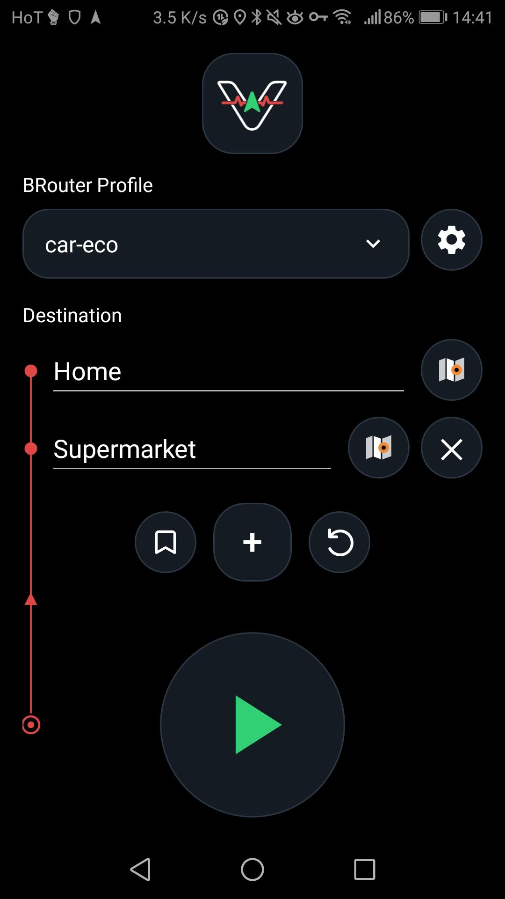
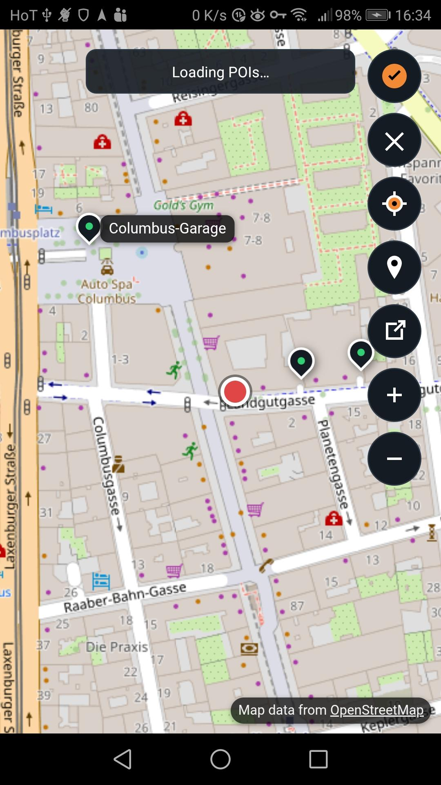
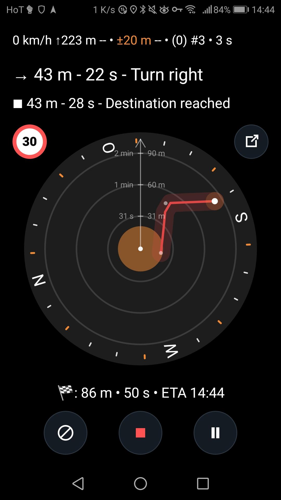

# ViBRo Navigator

  

**ViBRo Navigator** (Vibrating/Vibe-coded BRouter Navigator) is a lightweight, offline-first, and battery-efficient Android navigation app built on top of BRouter. It is designed for **map-free navigation**, delivering directions exclusively through **vibrations and minimal on-screen guidance**, enabling distraction-free and screen-off usage.

---

<table align="center" cellspacing="0" cellpadding="0" border="0">
  <tr>
    <td align="center" width="220">
      
    </td>
    <td align="center" width="220">
      
    </td>
    <td align="center" width="220">
      
    </td>
  </tr>
</table>

## ✨ Key Features

* **Vibration-based navigation**
  Clear directional feedback without relying on visual maps. Navigation directions are provided as notifications with different vibration patterns. Best in combination with a smartwatch or smartband that show them.

* **Offline-first routing**
  Uses BRouter for fully offline route calculation.

* **Minimal & dependency-light**
  Built in pure Java with minimal external dependencies. APK size is ~250Kb for the F-Droid version and ~500Kb for the GPlay version !!

* **Smart POI search**

  * History-first suggestions
  * OpenStreetMap search
  * Open from other maps application

* **Map-free compass navigation**
  Visualizes route direction relative to your position without rendering a map.

* **Intermediate stops support**
  Easily add, edit, and remove waypoints.

* **Dynamic navigation updates**
  Adaptive polling, rerouting, and turn estimation based on real-time conditions.

* **Pause and blocked road support**
  Navigation can be paused and rerouted to avoid a blocked street.

* **Background navigation**
  Works with screen off via a foreground service.

---

## 🧭 How It Works

1. Select a **routing profile** (from BRouter).
2. Enter a **destination** (or pick from history/map).
3. Optionally add **intermediate stops**.
4. Start navigation:

   * The app calculates the route via BRouter.
   * Guidance is delivered through:

     * Vibrations
     * Minimal text directions
     * Notifications (smartband-friendly)

ViBRo-Navigator prioritizes **high-confidence guidance**—when accuracy is low, it delays instructions instead of risking incorrect directions.

---

## 🔋 Design Principles

* **Battery conscious**: optimized location polling and no persistent wake locks
* **Offline capable**: routing works without internet
* **Minimal UI**: distraction-free experience
* **Robustness-first**: avoids misleading instructions under uncertainty
* **Orientation-safe**: supports portrait and landscape layouts

---

## 📦 Requirements

* Android device (min SDK 21)
* BRouter installed (required for routing)

---

## ⚙️ Developer Notes

* Pure Java implementation
* Minimal architecture with focused components
* Navigation logic split into small, testable modules
* Check [`AGENT.md`](./AGENT.md) and [`SPECIFICATION.md`](./SPECIFICATION.md) for more details

---

## 📄 License

MIT

---

## 🚀 Vision

ViBRo Navigator rethinks navigation:
**no maps, no noise — just reliable, intuitive guidance you can feel.**
